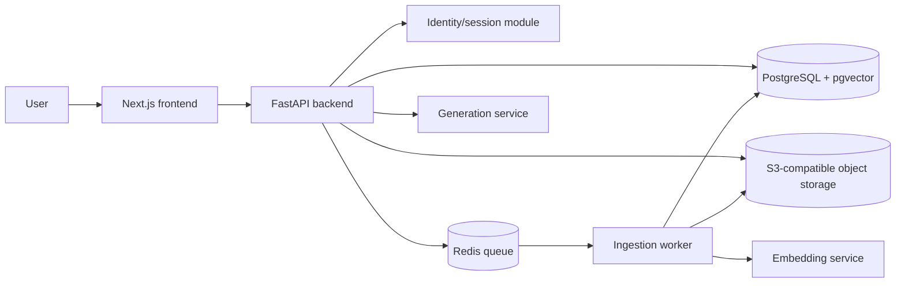
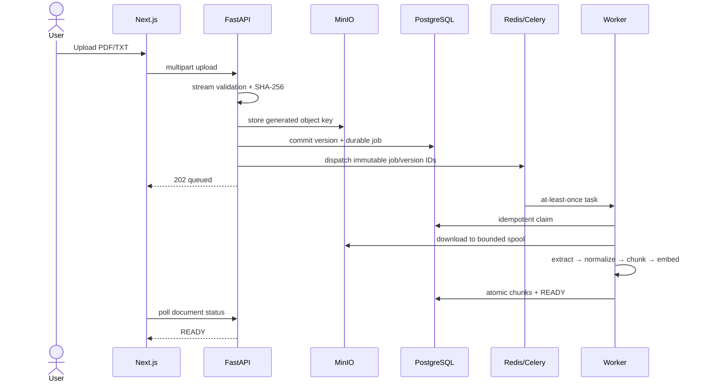
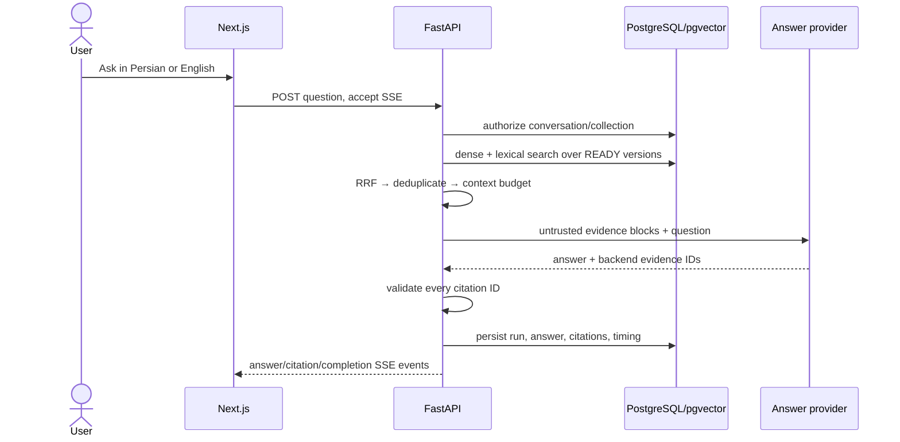

# System overview

## Context

The browser talks only to the backend API. The backend owns authorization, application rules, persistence, orchestration, and access to AI providers. Long-running ingestion work is executed by a worker. Original files live in object storage; relational product data and vectors initially live in PostgreSQL.



PostgreSQL is authoritative. Redis transports work but does not own job state. MinIO owns
immutable uploaded bytes; database rows own identity, authorization, lifecycle, and provenance.

## Frontend style

The Next.js App Router owns routing, locale layouts, metadata, and provider composition. Feature
components remain outside `app/`; TanStack Query hooks own remote server state, resource API
functions own endpoint calls, and Zod schemas validate every unknown response at the transport
boundary. Answer SSE uses a dedicated Fetch/ReadableStream adapter because it has a different
lifecycle from finite REST requests. See the
[frontend architecture guide](../engineering/frontend-architecture.md) for the dependency rules,
folder responsibilities, and request flow.

## Backend style

The backend is a modular monolith. Each module owns its vocabulary and behavior, while sharing one deployment and database initially. Application code depends on interfaces; infrastructure adapters implement database, object-storage, queue, embedding, reranking, and generation access.

Sprint 1 modules:

- `collections`: collection ownership and creation.
- `documents`: stable documents, immutable versions, upload, status, and pagination.
- `ingestion`: extraction, normalization, chunking, embedding, and job state.
- `retrieval`: scoped dense/lexical search, fusion, deduplication, and context packing.
- `conversations`: questions, answers, citations, history, and streaming.
- `identity`: registration, Argon2id credentials, opaque sessions, and recovery.
- `feedback`: ownership-checked structured judgment tied to an exact RAG run.
- `data_lifecycle`: durable, retryable cleanup of tombstoned source and derived evidence.

## Authentication and authorization flow

Authentication answers “who is this request?” Authorization answers “may this user act on this
resource?”. The API hashes the opaque cookie token, resolves a live database session and active user,
then passes only the internal user UUID to product use cases. Email is never a resource foreign key.

```mermaid
sequenceDiagram
    actor User
    participant UI as Next.js
    participant API as FastAPI
    participant DB as PostgreSQL
    participant Redis
    User->>UI: email + password + optional display name
    UI->>API: register
    API->>Redis: enforce IP + email registration limits
    API->>DB: atomic unique email + Argon2id credential + session
    API-->>UI: HttpOnly session + readable bound CSRF cookie
    User->>UI: open owned collection
    UI->>API: cookie; unsafe requests also Origin + CSRF header
    API->>DB: resolve digest, expiry, revocation, active user
    API->>DB: query with owner UUID predicate
    User->>UI: logout
    UI->>API: DELETE session
    API->>DB: revoke current digest
```

## Ingestion flow

1. API validates identity, access, metadata, type, and size.
2. Original file is stored and a document version is created transactionally.
3. A durable ingestion job is queued; upload returns immediately.
4. Worker extracts page-aware text and records extraction diagnostics.
5. Text is normalized for retrieval while source text is preserved for citations.
6. Deterministic chunks are generated and embedded in batches.
7. The new document version becomes ready only after all required artifacts commit.

Jobs must be idempotent: retrying the same document version cannot create duplicate chunks.
Celery delivery is at-least-once. A periodic dispatch reconciler leases old queued database jobs
and sends them again when the API may have crashed between the database commit and broker send.
The worker's database claim makes the resulting duplicate messages harmless.



## Query flow

1. API resolves the user's allowed document versions before retrieval.
2. The query is normalized and optionally rewritten using conversation context.
3. Dense and lexical searches produce candidates inside that authorization scope.
4. Results are fused with deterministic RRF and deduplicated. No reranker is enabled because the
   Sprint 1 evaluation does not yet demonstrate enough benefit to pay its latency/memory cost.
5. Context is packed within a measured token budget.
6. The generation model produces a structured answer referencing source identifiers.
7. Citations are validated and the answer streams to the browser.
8. Retrieval, model, latency, and feedback signals are recorded without logging private document content by default.



## Process and health boundaries

`app.entrypoints.api` composes the HTTP process and `app.entrypoints.worker` composes Celery tasks.
`GET /api/v1/health` is liveness and does not touch dependencies. `GET /api/v1/ready` checks
PostgreSQL, Redis, and MinIO independently and returns a safe 503 envelope if any required
dependency cannot serve traffic.

The CLI is a separate presentation entry point over the same identity use cases. It creates
short-lived password-reset tokens and performs confirmed account/session administration; no public
admin HTTP panel exists.

Deletion follows the same outbox-like durability principle as ingestion dispatch: the API commits
the tombstone and cleanup job together, dispatches only after commit, and a periodic reconciler
repairs broker-send gaps. The cleanup worker removes object bytes before deleting citations and
chunks, then redacts retained tombstone metadata and marks the job succeeded.

## Dependency rule

Domain rules do not import FastAPI, SQLAlchemy, Redis, model SDKs, or storage SDKs. Infrastructure may depend inward on domain and application contracts. This keeps business behavior testable and makes provider replacement controlled.
