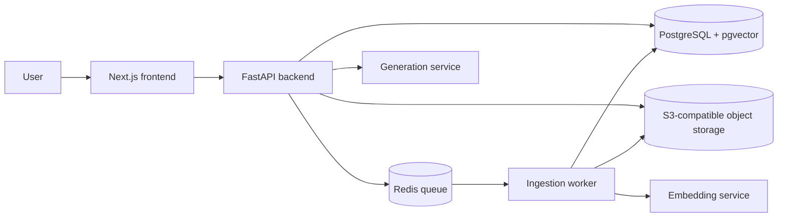
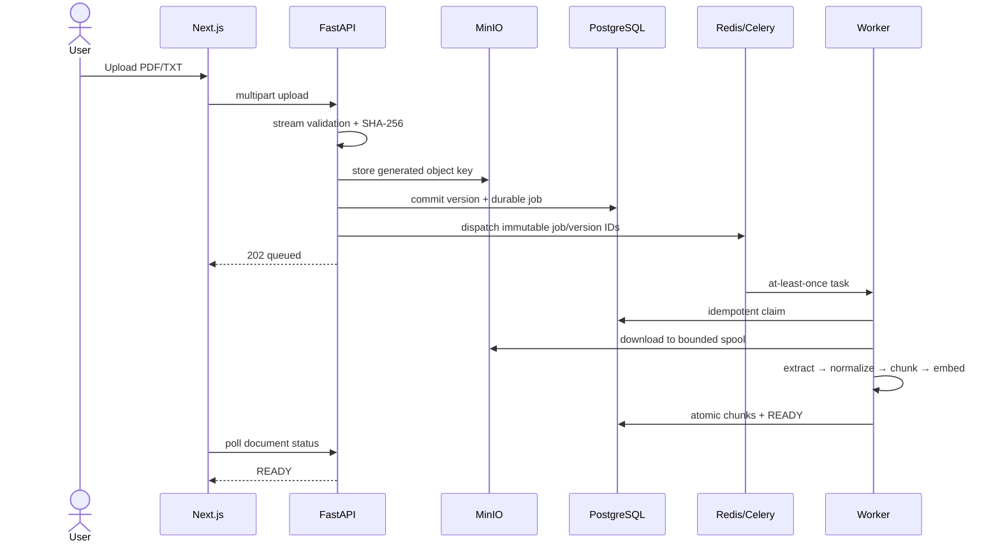
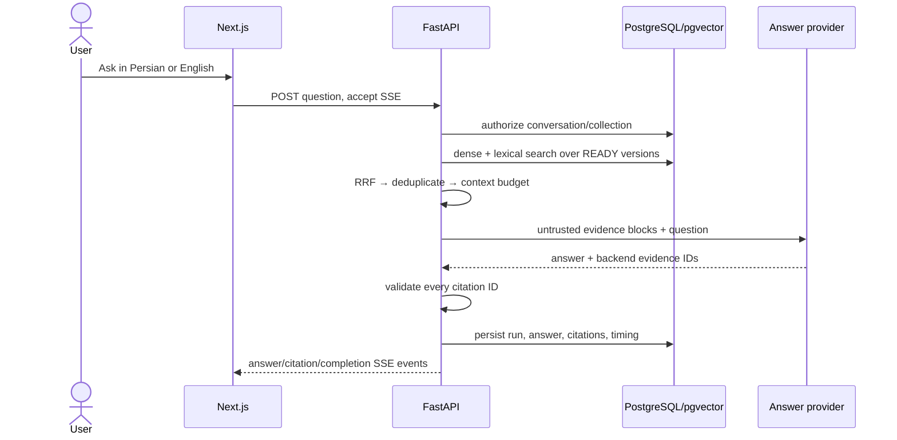

# System overview

## Context

The browser talks only to the backend API. The backend owns authorization, application rules, persistence, orchestration, and access to AI providers. Long-running ingestion work is executed by a worker. Original files live in object storage; relational product data and vectors initially live in PostgreSQL.

PostgreSQL is authoritative. Redis transports work but does not own job state. MinIO owns
immutable uploaded bytes; database rows own identity, authorization, lifecycle, and provenance.

## Backend style

The backend is a modular monolith. Each module owns its vocabulary and behavior, while sharing one deployment and database initially. Application code depends on interfaces; infrastructure adapters implement database, object-storage, queue, embedding, reranking, and generation access.

Sprint 1 modules:

- `collections`: collection ownership and creation.
- `documents`: stable documents, immutable versions, upload, status, and pagination.
- `ingestion`: extraction, normalization, chunking, embedding, and job state.
- `retrieval`: scoped dense/lexical search, fusion, deduplication, and context packing.
- `conversations`: questions, answers, citations, feedback, and streaming.

## Ingestion flow

1. API validates identity, access, metadata, type, and size.
2. Original file is stored and a document version is created transactionally.
3. A durable ingestion job is queued; upload returns immediately.
4. Worker extracts page-aware text and records extraction diagnostics.
5. Text is normalized for retrieval while source text is preserved for citations.
6. Deterministic chunks are generated and embedded in batches.
7. The new document version becomes ready only after all required artifacts commit.

Jobs must be idempotent: retrying the same document version cannot create duplicate chunks.
Celery delivery is at-least-once. A periodic dispatch reconciler leases old queued database jobs
and sends them again when the API may have crashed between the database commit and broker send.
The worker's database claim makes the resulting duplicate messages harmless.

## Query flow

1. API resolves the user's allowed document versions before retrieval.
2. The query is normalized and optionally rewritten using conversation context.
3. Dense and lexical searches produce candidates inside that authorization scope.
4. Results are fused with deterministic RRF and deduplicated. No reranker is enabled because the
   Sprint 1 evaluation does not yet demonstrate enough benefit to pay its latency/memory cost.
5. Context is packed within a measured token budget.
6. The generation model produces a structured answer referencing source identifiers.
7. Citations are validated and the answer streams to the browser.
8. Retrieval, model, latency, and feedback signals are recorded without logging private document content by default.

## Process and health boundaries

`app.entrypoints.api` composes the HTTP process and `app.entrypoints.worker` composes Celery tasks.
`GET /api/v1/health` is liveness and does not touch dependencies. `GET /api/v1/ready` checks
PostgreSQL, Redis, and MinIO independently and returns a safe 503 envelope if any required
dependency cannot serve traffic.

## Dependency rule

Domain rules do not import FastAPI, SQLAlchemy, Redis, model SDKs, or storage SDKs. Infrastructure may depend inward on domain and application contracts. This keeps business behavior testable and makes provider replacement controlled.
