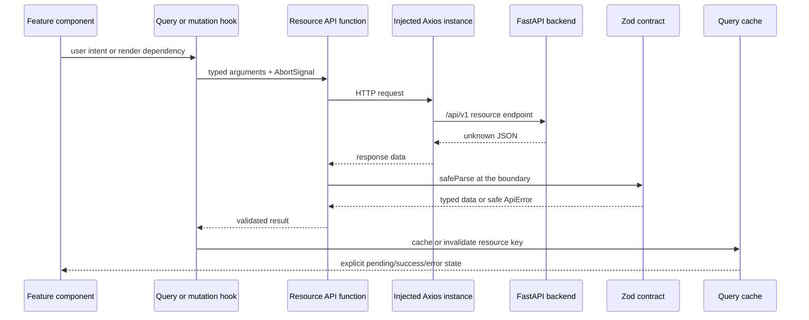

# Frontend architecture

## Purpose

The frontend is a Next.js App Router application with one interactive Document Q&A feature. Its
structure separates framework routing, remote-data orchestration, transport contracts, feature
state, and presentation without introducing layers that have no current consumer.

The installed Next.js 16 documentation is the source of truth for framework conventions. The
application therefore keeps `app/` for layouts, pages, metadata, and provider composition. It does
not duplicate routing with `pages/` or a custom `router/` directory.

## Source structure

```text
frontend/src/
  app/
    [locale]/                 route, metadata, and page composition
    providers.tsx            browser QueryClient boundary
  components/ui/             shared visual primitives
  features/document-qa/
    components/              focused feature presentation
    hooks/                   query, mutation, upload, and streaming orchestration
    model/                   pure feature state and presentation rules
    document-qa-workspace.tsx feature composition shell
    index.ts                 small public feature API
  schema/
    api/                     shared backend error envelope
    collection/              collection contracts
    conversation/            conversation, citation, and SSE contracts
    document/                document and ingestion-state contracts
  services/
    api/
      collections/           collection endpoints
      conversations/         conversation endpoints and SSE transport
      documents/             upload, pagination, and retry endpoints
      core-api.ts             configured Axios transport and response validation
      api-error.ts            safe transport-error normalization
    runtime-config.ts         validated public runtime configuration
  i18n/                      locale routing and message loading
```

Folder names represent real responsibilities. There is no generic `utils`, catch-all service,
global enum directory, or duplicate router. A capability stays inside its feature until a real
second consumer makes sharing necessary.

## REST request flow



API functions accept an `AxiosInstance` instead of importing browser state. This makes each
endpoint independently testable and leaves room for a future authenticated instance. Hooks use
the configured `coreApi`, own TanStack Query lifecycle, and expose feature-oriented operations to
components. Components never parse backend payloads or construct URLs.

## Streaming exception

Answer streaming uses the browser Fetch/ReadableStream API rather than Axios because browser Axios
does not expose Server-Sent Event chunks with the same direct cancellation semantics. The stream
adapter still belongs to `services/api`, validates every event payload with Zod, preserves partial
frames between chunks, and emits a typed `AnswerStreamEvent` union.

`useDocumentChat` owns the active abort controller, lazy conversation identity, transcript, retry,
and cancellation lifecycle. The pure `applyAnswerEvent` reducer updates one assistant message, so
stream behavior can be tested without rendering React.

## State ownership

| State | Owner | Reason |
| --- | --- | --- |
| Collection and document responses | TanStack Query cache | Remote state needs cancellation, retry, deduplication, and invalidation. |
| Document pagination | `useInfiniteQuery` | The cursor is part of the backend resource contract. |
| Ingestion polling | `useDocuments` | Polling runs only while at least one document is processing. |
| Upload progress and abort | `useDocumentUpload` | This is one mutation lifecycle, not durable server state. |
| Conversation transcript | `useDocumentChat` | Streaming produces ordered partial client state. |
| Composer text and selected citation | Nearest component | These values are ephemeral presentation state. |
| Active collection ID | Local storage adapter inside `useActiveCollection` | It restores the current workspace without treating browser storage as authoritative data. |

The backend remains authoritative for authorization, document state, citations, and RAG behavior.
Local storage contains only an opaque collection ID; restoring it always performs a validated API
read.

## Dependency direction

```text
app → feature shell → hooks/components
hooks → resource API functions → core transport
resource API functions → Zod schemas
components → UI primitives + feature model
```

Schemas and feature models never import React. Components do not import Axios. Resource API
functions do not import TanStack Query. This keeps each layer focused and makes replacement or
testing occur at an explicit boundary.

## Verification expectations

For frontend changes, run:

```bash
pnpm lint
pnpm typecheck
pnpm test
pnpm build
```

Behavior tests cover the public workspace flow. Boundary tests cover injected endpoint clients,
invalid response contracts, file validation, stream frame parsing, and partial-answer reduction.
Visual changes still require Persian and English inspection at mobile and desktop widths.
